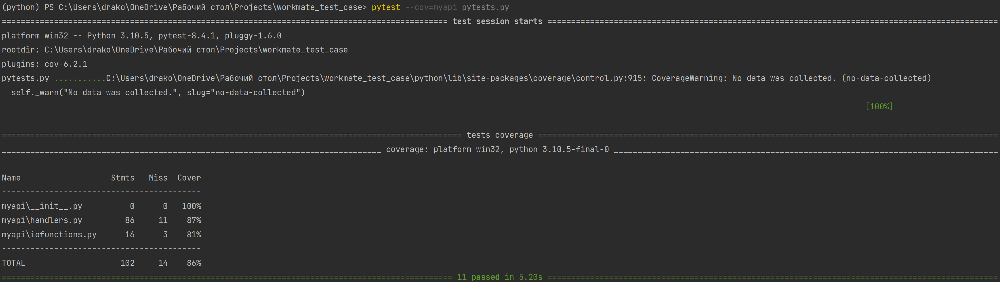

# workmate_test_case
Тестовое задание "Обработка csv файла" для вакансии в Workmate (Junior Python-developer).

## Требования
* Python 3.10 и выше;
* Библиотеки из файла _requirements.txt_.

## Особенности
* Масштабирование нацелено на добавление более сложных функций, которые требуют использования нескольких аргументов.
* Реализован _order-by_.
* Действие _order-by_ не будет выполнено, если выполняется агрегация.

## Запуск
* Программа
`python main.py --file data/products.csv --where "price>100" --order-by "price=desc"`
* Тесты
`pytest --cov=myapi pytests.py`

## Тестирование (_pytest_)

## Примеры запуска

